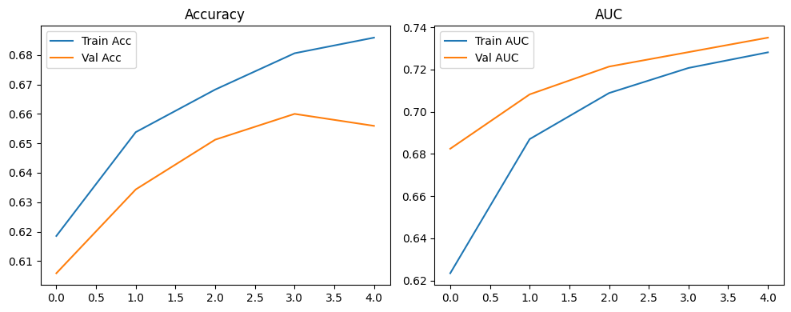

# 🦴 Bone Fracture AI Assistant

An industry-grade, enterprise-ready Medical AI Assistant that utilizes advanced Computer Vision to detect bone fractures in X-ray images. 

This project aims to provide an automated, highly-accurate second opinion for medical professionals using a custom-trained deep learning model, enveloped in a beautifully crafted, modern user interface.

## 🌟 Key Features

- **Advanced AI Model**: Powered by a custom **DenseNet121** Convolutional Neural Network (CNN) trained specifically for medical X-ray imaging.
- **Intelligent Image Preprocessing**: Employs an intensive OpenCV pipeline (Gamma Correction, CLAHE Contrast Enhancement, Gaussian Blur, Sobel Edge Detection) to optimize X-rays for analysis.
- **Explainable AI (XAI)**: Generates Grad-CAM (Gradient-weighted Class Activation Mapping) heatmaps to localize the fracture and explain the model's decision visually.
- **Premium User Experience**: A completely bespoke, modern frontend built with **React** & **Vite**. Features glassmorphism design, micro-animations, and drag-and-drop capabilities.
- **High-Performance Backend**: Decoupled, asynchronous **FastAPI** backend for highly concurrent image processing and RESTful API endpoints.

## 📊 Model Performance

The custom DenseNet121 model was evaluated on a dedicated validation set of X-ray images, achieving the following baseline performance metrics:
- **Validation Accuracy**: ~65.6%
- **AUC (Area Under the ROC Curve)**: 0.735
- **Validation Loss**: 0.6219

*(Note: The model prioritizes AUC and robust feature extraction. Performance can be further enhanced with larger proprietary medical datasets.)*

### Training History


## 🛠️ Technology Stack

**Frontend**
- React.js (Vite)
- Custom CSS (Glassmorphism, Animations)
- Axios & Lucide React (Iconography)

**Backend & AI**
- Python 3 & FastAPI (Uvicorn)
- TensorFlow & Keras (Model Inference)
- OpenCV & scikit-image (Computer Vision)
- Pydantic (Data Validation)

## 🚀 Quick Start Guide

### 1. Setup the Environment
We recommend using Conda to manage your dependencies.
```bash
conda create -n ML_DL_venv python=3.10
conda activate ML_DL_venv
```

### 2. Start the Backend API (FastAPI)
The AI engine runs on port `8001` to avoid conflicting with other standard services.
```bash
cd backend
pip install -r requirements.txt
python main.py
```
> The API will be available at: http://localhost:8001
> Interactive API Docs: http://localhost:8001/docs

### 3. Start the Frontend (React)
Open a new terminal window and start the client application.
```bash
cd frontend
npm install
npm run dev
```
> The UI will be available at: http://localhost:5173 (or 5174/5175 depending on availability)

## 📁 Project Architecture
```text
fracture_detection_computer_vision/
├── backend/                         # FastAPI Application Layer
│   ├── main.py                      # API entry point & routes
│   ├── services/                    # Business logic & AI inference
│   ├── config/                      # Application settings
│   └── utils/                       # Helper functions & logging
├── frontend/                        # React Web Client
│   ├── src/
│   │   ├── components/              # UI Components (Upload, Results)
│   │   ├── App.jsx                  # Main application state
│   │   └── index.css                # Premium styling system
├── final_densenet_fracture_model.h5 # Pre-trained Keras Model weights
└── README.md                        # Project documentation
```

## ⚠️ Medical Disclaimer
This AI tool is designed strictly as a supplementary aid to assist qualified medical professionals. It **does not** replace clinical judgment, professional medical diagnosis, or treatment. Always consult with a certified healthcare provider.